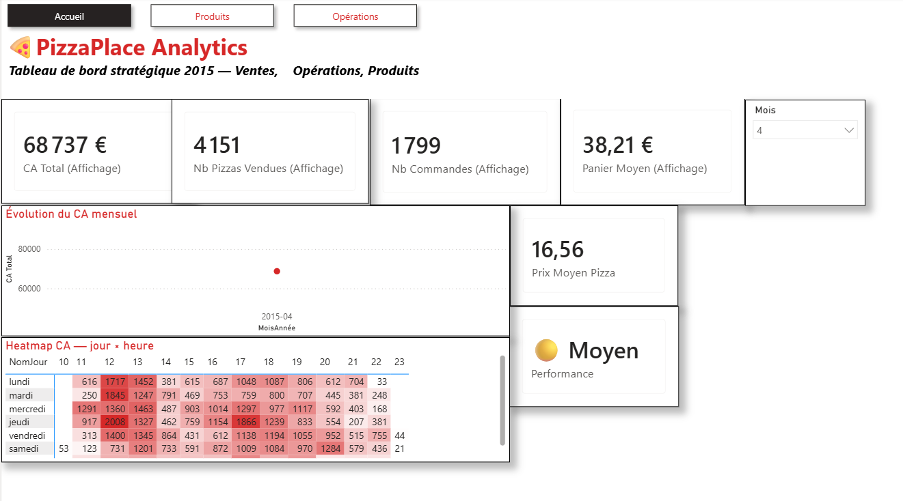
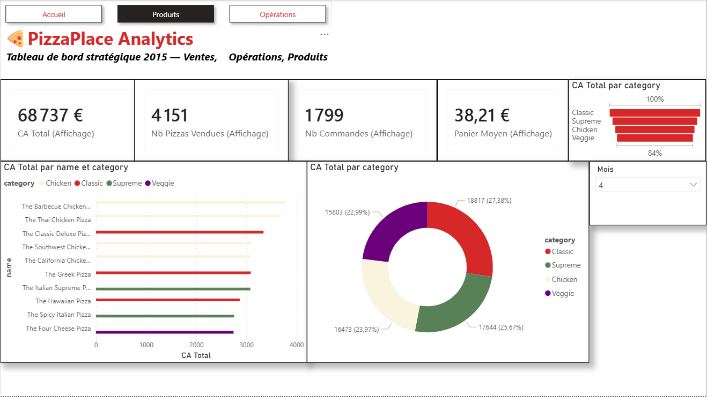
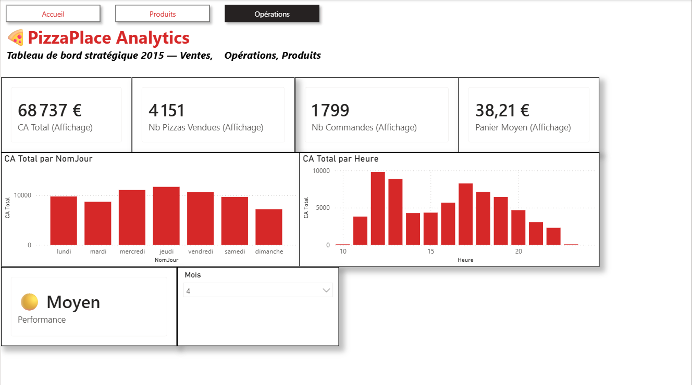

PizzaPlace Analytics — Dashboard Power BI

Contexte

Dashboard Power BI complet d'analyse des ventes d'une chaîne de pizzerias sur l'année 2015, avec environ 50 000 lignes de ventes exploitées.

Objectifs métiers

- Suivre la performance commerciale : chiffre d'affaires, nombre de commandes, panier moyen
- Identifier les pizzas et catégories les plus performantes
- Analyser les périodes fortes : jours, heures et mois
- Aider à la prise de décision commerciale et opérationnelle

Stack technique

- **Power BI Desktop** — modélisation et visualisation
- **Power Query** — nettoyage et transformation des données
- **DAX** — mesures calculées et indicateurs
- **Git / GitHub** — versioning et portfolio projet

Dashboards

Accueil

Vue globale des KPIs principaux : chiffre d'affaires, nombre de pizzas vendues, nombre de commandes, panier moyen, évolution mensuelle et heatmap horaire.

Produits

Analyse du mix produit : chiffre d'affaires par pizza, répartition par catégorie et top pizzas.

Opérations

Analyse opérationnelle des ventes par jour de semaine et par heure afin d'identifier les périodes les plus performantes.

Mesures DAX clés

- **CA Total** : calcul du chiffre d'affaires
- **Nombre de commandes**
- **Nombre de pizzas vendues**
- **Panier moyen**
- **Prix moyen pizza**
- **Mesures d'affichage** pour améliorer la lisibilité des KPIs
- **Indicateur de performance** avec logique conditionnelle

Fonctionnalités

- Navigation entre les pages
- Filtres interactifs par mois
- Infobulle personnalisée sur les pizzas
- KPIs business
- Visualisations organisées par thème : Accueil, Produits, Opérations

Fichier Power BI

Le fichier Power BI est disponible ici :

[powerbi/pizzaplace_analytics.pbix](powerbi/pizzaplace_analytics.pbix)

Auteur

Projet réalisé par Sèwèdo HOUNSONLON.
